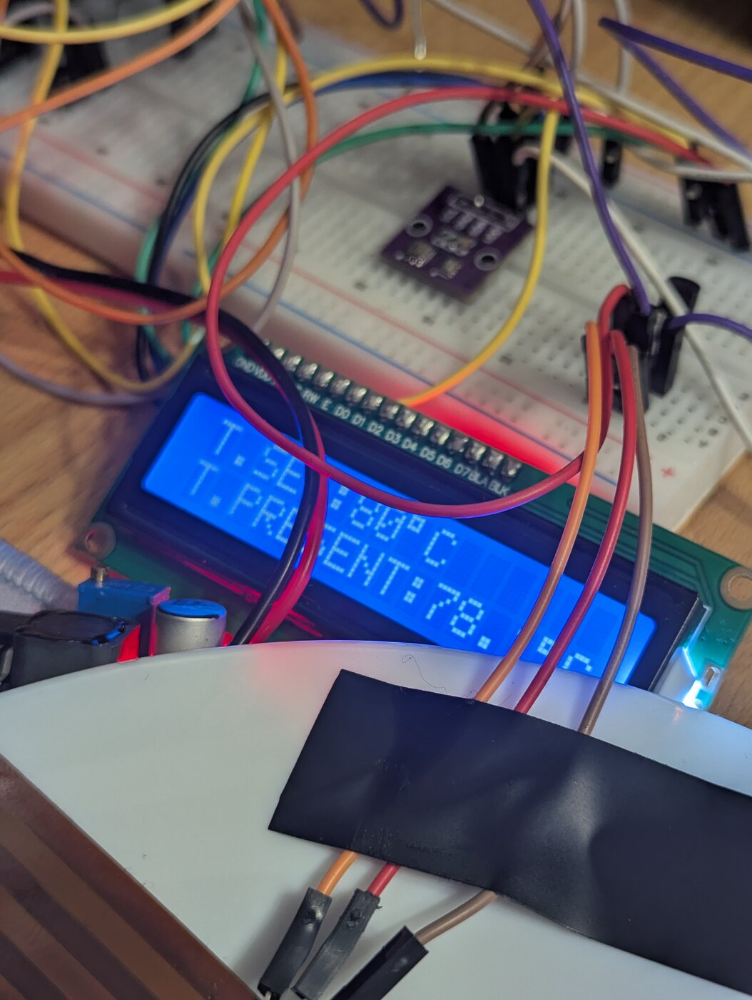
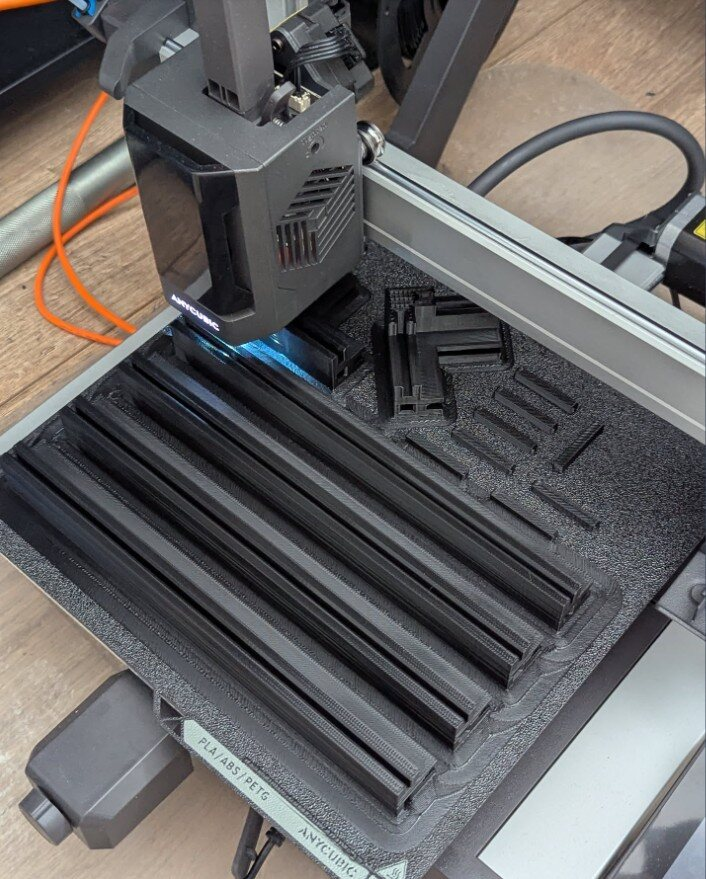
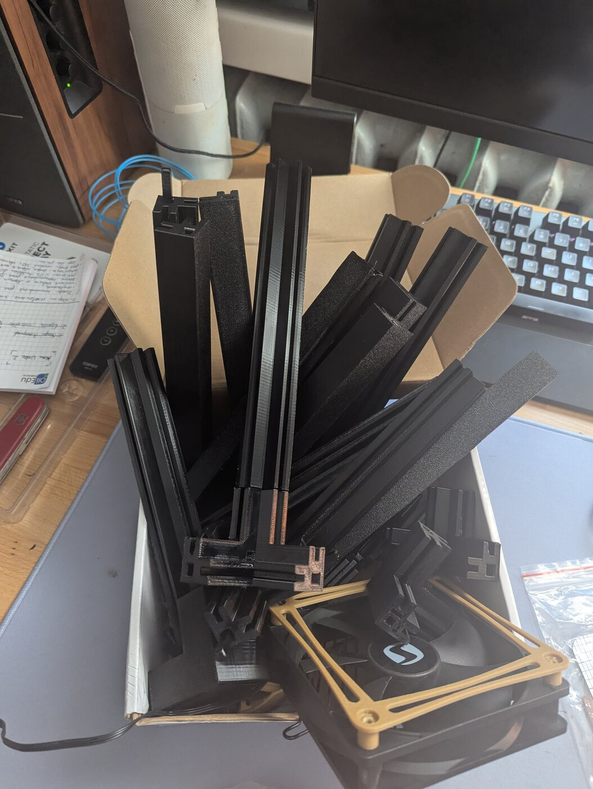
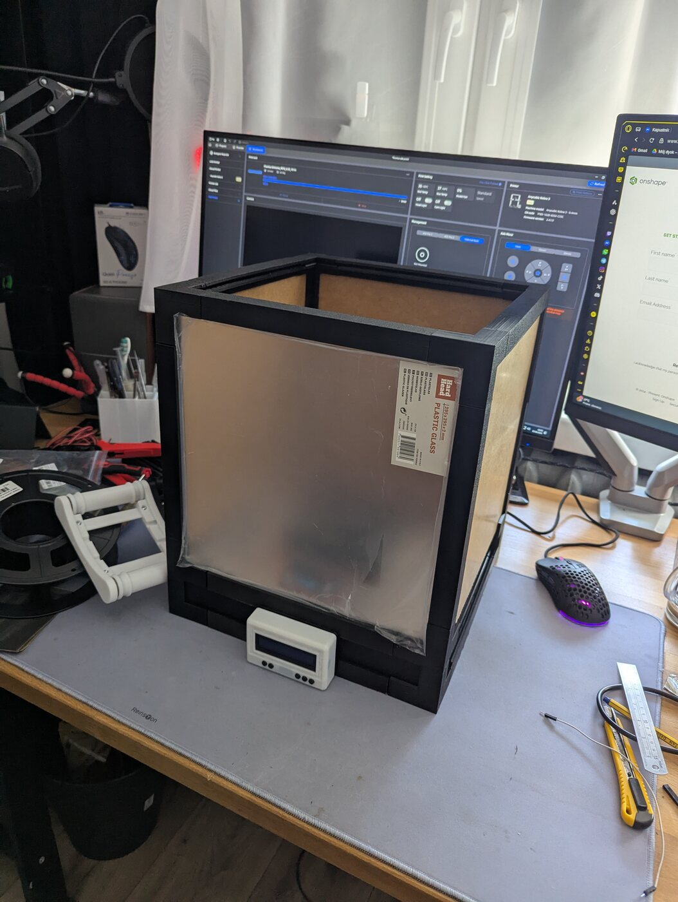
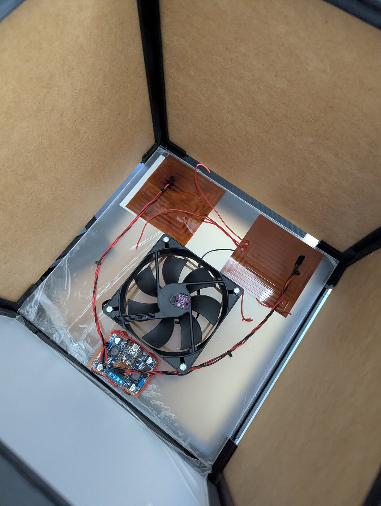
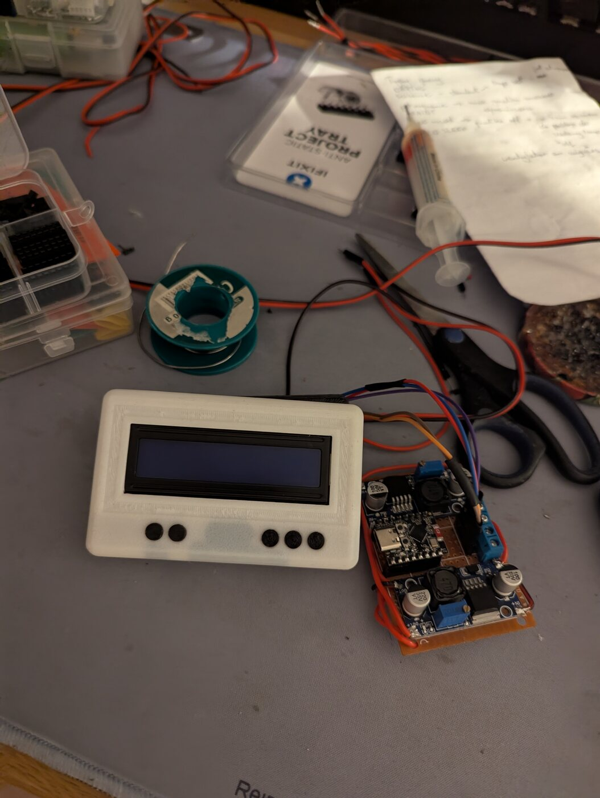
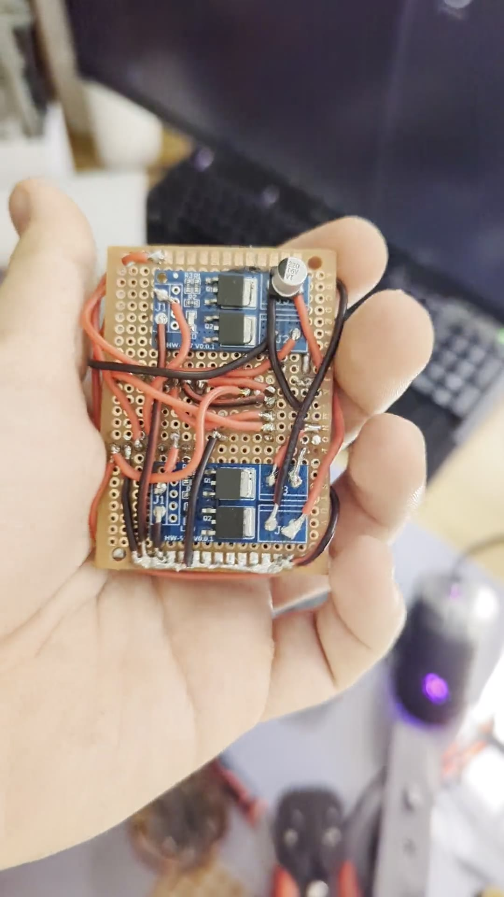
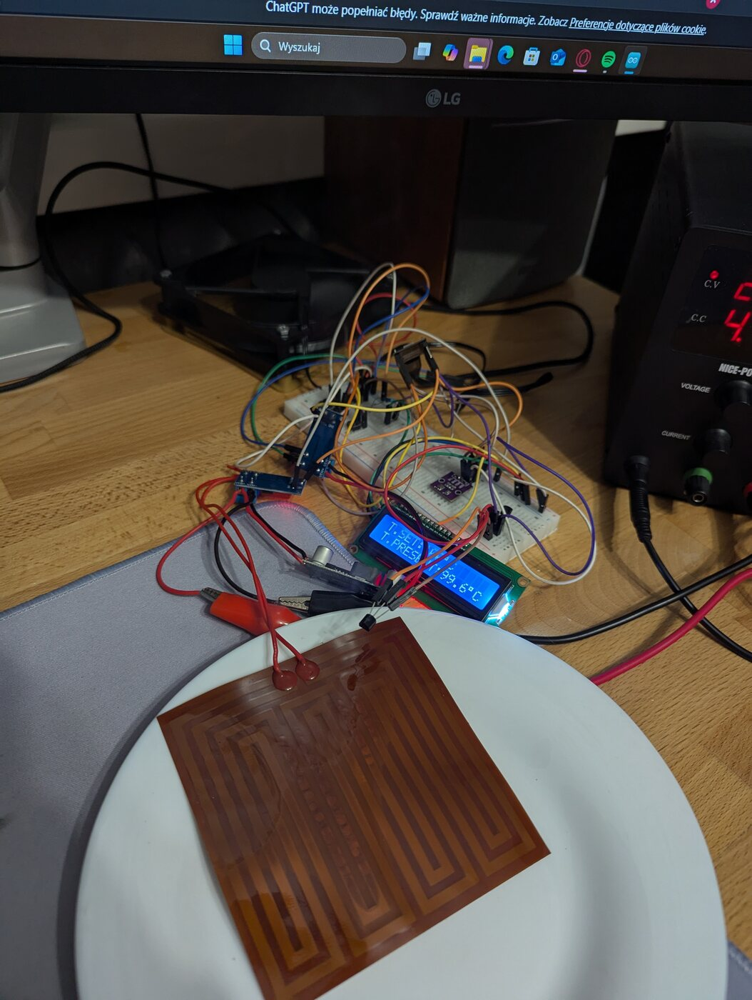
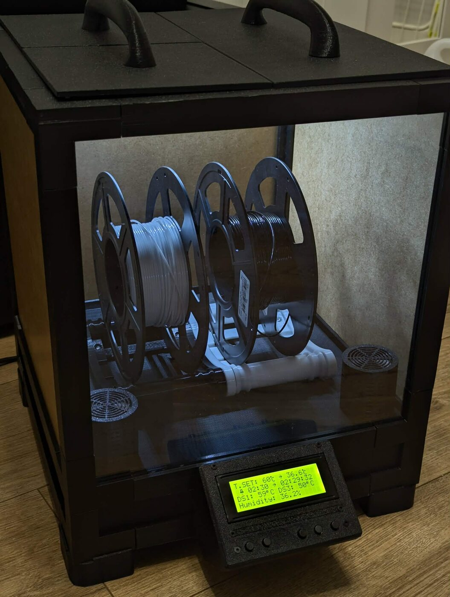
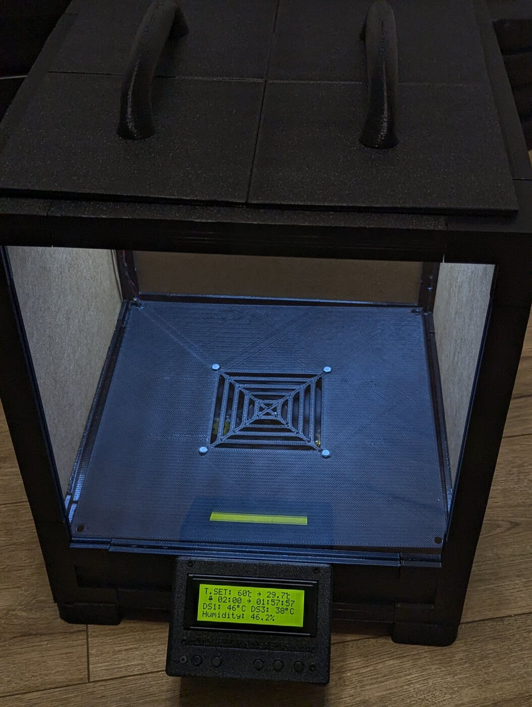

# Build log

[← back to README](../../README.md) · [🇵🇱 wersja polska](../pl/dziennik-budowy.md)

Photographs from the build of version 1, roughly in the order things happened. Version 2 changes are
at the bottom.

---

## 1. Breadboard prototype

Before anything was designed in CAD, the whole electronics stack was assembled on the bench: the
ESP32-C3, the LCD, the I²C sensors and the MOSFET drivers, all wired loosely so the pin assignment
and the sensor readings could be verified against a working display.

This stage is the reason the pin map in [`config.h`](../../firmware/v3-freertos/include/config.h)
looks the way it does — the pins were chosen here and never changed afterwards.

---

## 2. Printing the frame

The enclosure is not a printed box. It is a set of printed corner brackets and edge profiles that
clamp 300×300 mm acrylic panels — far less filament, far shorter print times, and a chamber you can
actually see into.

Every part was drawn in Autodesk Inventor; the sources are in
[`hardware/v1/cad/`](../../hardware/v1/cad/).

---

## 3. Printed parts

The full set of corners, brackets and connectors laid out before assembly. Several parts exist in
multiple revisions — the superseded ones are kept in the `OldVersions/` folders rather than deleted,
so the design history stays visible.

---

## 4. Assembling the enclosure

Frame and acrylic panels going together into the chamber.

---

## 5. Chamber interior

Working out the internal layout: where the heating mats and their heatsinks sit, how air moves past
them, and how the spools are supported so they can turn freely.

---

## 6. Controller board and display

The electronics moved off the breadboard onto a prototype board, and the LCD went into its printed
front-panel mount.

**Video:** [controller board walkthrough](../media/controller_board.mp4) *(2.6 MB, no sound)*

---

## 7. Safety

250 W of heating running unattended for hours deserves respect. Wiring was sized for the current,
the mats got dedicated DS18B20 sensors, and the firmware got a hard over-temperature cut-off that
zeroes the setpoint at 110 °C and refuses to re-arm until every mat is back under 70 °C — see
[`control_task.cpp`](../../firmware/v3-freertos/src/tasks/control_task.cpp).

---

## 8. Finished v2

---

## Version 2 — display upgrade

The 20×2 LCD was replaced with a 20×4, which meant the display code had to be rewritten so that all
values still landed in sensible places. The mount itself was reprinted in **ABS** instead of PETG,
because it sits close to the warm chamber wall and PETG was too soft there.

Version 2 also brought a new base with a denser hole pattern for better airflow, and a third heating
mat with its own heatsink — together these cut the warm-up time noticeably. Details in the
[changelog](changelog.md).
