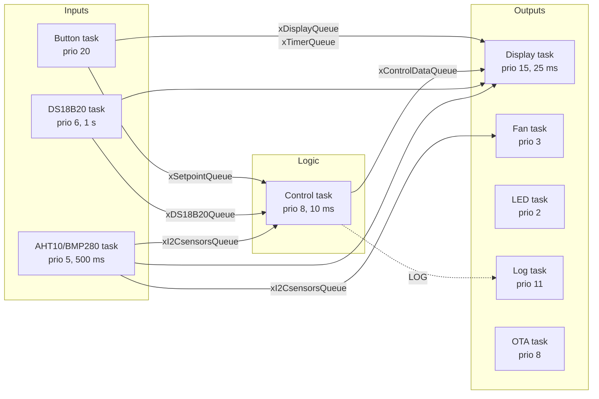

# Firmware

[← back to README](../../README.md) · [🇵🇱 wersja polska](../pl/firmware.md)

---

## Two generations

The firmware exists in two forms, both kept in the repository on purpose.

**[`firmware/v1-arduino/`](../../firmware/v1-arduino/)** — the original: one 729-line `.ino` file,
a single `loop()` doing sensor reads, PID, display refresh and button polling in sequence. It worked,
but the display flickered, button presses were missed while the LCD was being redrawn, and adding
anything meant threading it through the same loop.

**[`firmware/v3-freertos/`](../../firmware/v3-freertos/)** — the rewrite. Every concern became its
own FreeRTOS task, communicating through queues, with interrupt-driven buttons, persistent settings
and OTA updates. That is what this document describes.

---

## Task architecture



| Task | Priority | Stack | Period | Responsibility |
|---|:--:|:--:|:--:|---|
| `vButtonTask` | 20 | 16384 | event | Debounce, auto-repeat, UI state machine, NVS writes |
| `vDisplayTask` | 15 | 8192 | 25 ms | Renders all LCD screens, runs the countdown |
| `vLogTask` | 11 | 2048 | blocking | Serialises log messages onto `Serial` |
| `vControlTask` | 8 | 4096 | 10 ms | PID loop, PWM output, over-temperature cut-off |
| `vOtaTask` | 8 | 2048 | 100 ms | `ArduinoOTA.handle()`, Wi-Fi reconnect |
| `vTempSensorTask` | 6 | 2048 | 1 s | Reads the three DS18B20 sensors |
| `vHumTempSensorTask` | 5 | 4096 | 500 ms | Reads AHT10 and BMP280 over I²C |
| `vFanTask` | 3 | 1024 | 100 ms | Fan PWM from chamber humidity |
| `vLedTask` | 2 | 1024 | 50 ms | Chamber LED PWM |

`loop()` deletes itself with `vTaskDelete(NULL)` — the Arduino loop task is not used at all.

### Why these priorities

The button task sits highest because a missed press is immediately obvious to the user, while a
sensor reading arriving 20 ms late is not. Sensors sit low because they are periodic and tolerant of
jitter. The logger sits above the control loop deliberately: it must be able to drain its queue even
when everything else is busy, otherwise log messages are silently dropped exactly when you most want
to read them.

---

## Inter-task communication

Every queue except the log and button queues has **depth 1** and is written with `xQueueOverwrite`
and read with `xQueuePeek`. This is a deliberate pattern: these queues carry *current state*, not
events. A consumer always sees the newest value, a producer never blocks, and a slow consumer cannot
build a backlog of stale readings.

| Queue | Depth | Payload | Producer → consumer |
|---|:--:|---|---|
| `xDS18B20Queue` | 1 | `DS_sensors` | sensor → control, display |
| `xI2CsensorsQueue` | 1 | `I2C_sensors` | sensor → control, display, fan |
| `xSetpointQueue` | 1 | `PID_data` | button, control → control, display |
| `xControlDataQueue` | 1 | `Control_status` | control → display |
| `xTimerQueue` | 1 | `Timer_data` | button, display → display |
| `xDisplayQueue` | 1 | `Display_data` | button → display |
| `xButtonQueue` | 10 | `ButtonRAW` | **ISR** → button task |
| `xLogQueue` | 10 | `char[LOG_MSG_LEN]` | all tasks → log task |

The button and log queues are true event queues, so they are deeper and are drained with
`xQueueReceive`.

### The I²C mutex

The LCD, AHT10 and BMP280 all share one I²C bus, and the display task and sensor task run at
different rates and priorities. `xI2CMutex` guards every transaction; without it a display refresh
interleaving with a sensor read corrupts both.

---

## Control loop

```c
pid.SetTunings(Kp, Ki, Kd);
pid.Input = i2c_sensors.temp_aht;   // chamber air temperature
pid.Compute();
ledcWrite(0, pid.Output);           // 0..1023 → MOSFET → heating mats
```

* Library: `br3ttb/PID` in `DIRECT` mode
* Output range `0..1023`, matching the 10-bit LEDC resolution
* Sample time 10 ms
* Default gains `Kp = 2.25`, `Ki = 0.05`, `Kd = 0.0` — editable on the device, capped at
  `Kp ≤ 20`, `Ki ≤ 10`, `Kd ≤ 5`

`SetTunings()` is called on every iteration so that gains edited on the LCD take effect immediately,
without restarting the loop.

When the setpoint drops to zero the PID is briefly switched to `MANUAL`, its output forced to zero,
and switched back to `AUTOMATIC`. This resets the integral term — otherwise accumulated windup would
make the heater kick back on the moment a new setpoint is dialled in.

### Over-temperature protection

```
any DS18B20 > 110 °C  →  setpoint = 0, output = 0, error = true
all DS18B20 <  70 °C  →  error = false   (heating may resume)
```

The hysteresis band between the two thresholds is what stops the system oscillating in and out of
its fault state. Thresholds live in `Calibration::Max_DS_temperature` and
`Calibration::Temp_after_error` in `config.h`.

---

## Timer

The drying timer counts in `Timer_data`, incremented in 15-minute steps
(`Calibration::Button_Add_Time`) and clamped to 24 hours. It starts as soon as a non-zero time is
first dialled in, and the countdown itself runs inside the display task. When it reaches zero the
setpoint is zeroed and the UI switches to the `DONE` screen.

---

## User interface

Five buttons, all interrupt-driven. The ISR does the minimum possible — capture pin, edge and
timestamp, push into `xButtonQueue`, yield:

```c
void IRAM_ATTR isrButton(void* arg) {
    ButtonRAW event;
    event.pin  = (uint32_t)arg;
    event.edge = (digitalRead(event.pin) == LOW) ? PRESSED : RELEASED;
    event.timestamp = millis();
    xQueueSendFromISR(xButtonQueue, &event, &woken);
}
```

Debouncing (150 ms) and hold-to-repeat (400 ms) are handled in the task, not the ISR.

### Screens

| Screen | Shows |
|---|---|
| `Main` | Setpoint, chamber temperature, timer, countdown, DS18B20 readings, humidity, Wi-Fi icon |
| `Sensors_data` | Raw values from every sensor |
| `PID_cook` | Kp / Ki / Kd editor, live temperature and PWM duty |
| `PID_fan` | Placeholder — fan PID not implemented |
| `DONE` | Drying finished |
| `TEMP_ERROR` | Over-temperature fault |
| `MODE` | Operating mode — placeholder |

**Enter** advances the screen, **Screen** selects which value on that screen is being edited
(shown by a `>` marker), **Increase** / **Decrease** change it, **Mode** cycles the operating mode.

### Custom LCD glyphs

`config.h` defines six 5×8 characters: a degree symbol, a bell for the timer, two halves of a Wi-Fi
icon, and two halves of a crossed-out Wi-Fi icon for the disconnected state.

---

## Persistence

PID gains are stored in NVS through the `Preferences` API and reloaded at boot by the control,
display and button tasks. Changing a gain writes it immediately — so a tuning session survives a
power cut, and the dryer comes back with the gains you actually arrived at.

---

## Wi-Fi and OTA

A static IP (`192.168.1.15`) is configured in `main.cpp`, and `ArduinoOTA` runs under the hostname
`Filament Dryer`. The OTA task also handles reconnection: if the link drops, it retries every five
seconds. **Wi-Fi is never blocking** — the dryer boots, heats and regulates perfectly well with no
network at all, and the LCD simply shows the crossed-out Wi-Fi icon.

Credentials live in `include/secrets.h`, which is git-ignored. Copy `include/secrets.h.example` and
fill in your own.

---

## Known issues

Openly tracked in the [roadmap](roadmap.md#known-issues) rather than hidden.
