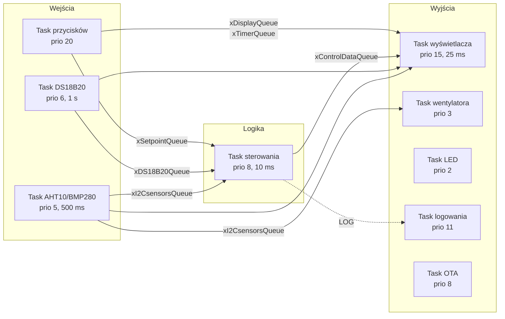

# Firmware

[← powrót do README](../../README.pl.md) · [🇬🇧 English version](../en/firmware.md)

---

## Dwie generacje

Firmware istnieje w dwóch wersjach i obie celowo zostały w repozytorium.

**[`firmware/v1-arduino/`](../../firmware/v1-arduino/)** — pierwotna: jeden plik `.ino` na 729 linii,
pojedyncza pętla `loop()` wykonująca po kolei odczyt czujników, PID, odświeżanie ekranu i
odpytywanie przycisków. Działała, ale ekran migotał, wciśnięcia przycisków ginęły w trakcie
przerysowywania LCD, a dodanie czegokolwiek oznaczało wplecenie tego w tę samą pętlę.

**[`firmware/v3-freertos/`](../../firmware/v3-freertos/)** — przepisana. Każda odpowiedzialność stała
się osobnym taskiem FreeRTOS, komunikującym się przez kolejki, z przyciskami na przerwaniach,
trwałymi ustawieniami i aktualizacją OTA. To właśnie ta wersja jest opisana poniżej.

---

## Architektura tasków



| Task | Priorytet | Stos | Okres | Odpowiedzialność |
|---|:--:|:--:|:--:|---|
| `vButtonTask` | 20 | 16384 | zdarzeniowo | Debounce, auto-powtarzanie, automat stanów UI, zapis do NVS |
| `vDisplayTask` | 15 | 8192 | 25 ms | Rysuje wszystkie ekrany LCD, prowadzi odliczanie |
| `vLogTask` | 11 | 2048 | blokująco | Serializuje komunikaty na `Serial` |
| `vControlTask` | 8 | 4096 | 10 ms | Pętla PID, wyjście PWM, zabezpieczenie termiczne |
| `vOtaTask` | 8 | 2048 | 100 ms | `ArduinoOTA.handle()`, ponowne łączenie z Wi-Fi |
| `vTempSensorTask` | 6 | 2048 | 1 s | Odczyt trzech czujników DS18B20 |
| `vHumTempSensorTask` | 5 | 4096 | 500 ms | Odczyt AHT10 i BMP280 po I²C |
| `vFanTask` | 3 | 1024 | 100 ms | PWM wentylatora na podstawie wilgotności |
| `vLedTask` | 2 | 1024 | 50 ms | PWM oświetlenia komory |

`loop()` usuwa sam siebie przez `vTaskDelete(NULL)` — pętla Arduino w ogóle nie jest używana.

### Skąd takie priorytety

Task przycisków jest najwyżej, bo zgubione wciśnięcie użytkownik zauważa natychmiast, a odczyt
czujnika spóźniony o 20 ms — nie. Czujniki są nisko, bo są okresowe i tolerują jitter. Logger jest
świadomie ponad pętlą sterowania: musi móc opróżnić swoją kolejkę nawet wtedy, gdy reszta systemu
jest zajęta, inaczej komunikaty gubią się dokładnie wtedy, kiedy najbardziej chce się je przeczytać.

---

## Komunikacja między taskami

Każda kolejka poza logiem i przyciskami ma **głębokość 1**, jest zapisywana przez `xQueueOverwrite`
i czytana przez `xQueuePeek`. To celowy wzorzec: te kolejki przenoszą *aktualny stan*, a nie
zdarzenia. Odbiorca zawsze widzi najnowszą wartość, nadawca nigdy się nie blokuje, a wolny odbiorca
nie zbuduje zaległości przeterminowanych odczytów.

| Kolejka | Głębokość | Dane | Nadawca → odbiorca |
|---|:--:|---|---|
| `xDS18B20Queue` | 1 | `DS_sensors` | czujniki → sterowanie, wyświetlacz |
| `xI2CsensorsQueue` | 1 | `I2C_sensors` | czujniki → sterowanie, wyświetlacz, wentylator |
| `xSetpointQueue` | 1 | `PID_data` | przyciski, sterowanie → sterowanie, wyświetlacz |
| `xControlDataQueue` | 1 | `Control_status` | sterowanie → wyświetlacz |
| `xTimerQueue` | 1 | `Timer_data` | przyciski, wyświetlacz → wyświetlacz |
| `xDisplayQueue` | 1 | `Display_data` | przyciski → wyświetlacz |
| `xButtonQueue` | 10 | `ButtonRAW` | **ISR** → task przycisków |
| `xLogQueue` | 10 | `char[LOG_MSG_LEN]` | wszystkie taski → task logowania |

Kolejki przycisków i logów to prawdziwe kolejki zdarzeń, więc są głębsze i opróżniane przez
`xQueueReceive`.

### Mutex I²C

LCD, AHT10 i BMP280 dzielą jedną magistralę I²C, a task wyświetlacza i task czujników pracują z
różnymi częstotliwościami i priorytetami. `xI2CMutex` chroni każdą transakcję; bez niego odświeżenie
ekranu przeplecione z odczytem czujnika psuje obie operacje.

---

## Pętla regulacji

```c
pid.SetTunings(Kp, Ki, Kd);
pid.Input = i2c_sensors.temp_aht;   // temperatura powietrza w komorze
pid.Compute();
ledcWrite(0, pid.Output);           // 0..1023 → MOSFET → maty grzewcze
```

* Biblioteka: `br3ttb/PID` w trybie `DIRECT`
* Zakres wyjścia `0..1023`, zgodny z 10-bitową rozdzielczością LEDC
* Czas próbkowania 10 ms
* Nastawy domyślne `Kp = 2,25`, `Ki = 0,05`, `Kd = 0,0` — edytowalne z urządzenia, ograniczone do
  `Kp ≤ 20`, `Ki ≤ 10`, `Kd ≤ 5`

`SetTunings()` wywoływane jest w każdej iteracji, dzięki czemu nastawy zmienione na LCD działają
natychmiast, bez restartu pętli.

Gdy setpoint spada do zera, PID jest na chwilę przełączany w `MANUAL`, jego wyjście zerowane, po czym
wraca do `AUTOMATIC`. To resetuje człon całkujący — bez tego nagromadzone nasycenie sprawiłoby, że
grzałka natychmiast ruszyłaby przy wpisaniu nowej wartości zadanej.

### Zabezpieczenie przed przegrzaniem

```
którykolwiek DS18B20 > 110 °C  →  setpoint = 0, wyjście = 0, error = true
wszystkie DS18B20  <  70 °C   →  error = false   (grzanie może wrócić)
```

Histereza między progami jest tym, co powstrzymuje system przed oscylowaniem wokół stanu awarii.
Progi znajdują się w `Calibration::Max_DS_temperature` i `Calibration::Temp_after_error` w
`config.h`.

---

## Timer

Czas suszenia liczony jest w strukturze `Timer_data`, zwiększany co 15 minut
(`Calibration::Button_Add_Time`) i ograniczony do 24 godzin. Startuje w momencie pierwszego
ustawienia niezerowego czasu, a samo odliczanie działa wewnątrz taska wyświetlacza. Po dojściu do
zera setpoint jest zerowany, a interfejs przełącza się na ekran `DONE`.

---

## Interfejs użytkownika

Pięć przycisków, wszystkie na przerwaniach. ISR robi absolutne minimum — zapisuje pin, zbocze i
znacznik czasu, wrzuca do `xButtonQueue` i oddaje sterowanie:

```c
void IRAM_ATTR isrButton(void* arg) {
    ButtonRAW event;
    event.pin  = (uint32_t)arg;
    event.edge = (digitalRead(event.pin) == LOW) ? PRESSED : RELEASED;
    event.timestamp = millis();
    xQueueSendFromISR(xButtonQueue, &event, &woken);
}
```

Debounce (150 ms) i auto-powtarzanie przy przytrzymaniu (400 ms) obsługiwane są w tasku, nie w ISR.

### Ekrany

| Ekran | Co pokazuje |
|---|---|
| `Main` | Wartość zadana, temperatura komory, timer, odliczanie, odczyty DS18B20, wilgotność, ikona Wi-Fi |
| `Sensors_data` | Surowe wartości ze wszystkich czujników |
| `PID_cook` | Edytor Kp / Ki / Kd, bieżąca temperatura i wypełnienie PWM |
| `PID_fan` | Miejsce zarezerwowane — PID wentylatora niezaimplementowany |
| `DONE` | Suszenie zakończone |
| `TEMP_ERROR` | Awaria — przekroczona temperatura |
| `MODE` | Tryb pracy — miejsce zarezerwowane |

**Enter** przechodzi do kolejnego ekranu, **Ekran** wybiera edytowaną wartość (oznaczoną znakiem
`>`), **Zwiększ** / **Zmniejsz** ją zmieniają, **Tryb** przełącza tryb pracy.

### Własne znaki LCD

`config.h` definiuje sześć znaków 5×8: symbol stopnia, dzwonek timera, dwie połówki ikony Wi-Fi
i dwie połówki przekreślonej ikony Wi-Fi dla stanu bez połączenia.

---

## Trwałość ustawień

Nastawy PID zapisywane są w NVS przez API `Preferences` i wczytywane przy starcie przez taski
sterowania, wyświetlacza i przycisków. Zmiana nastawy zapisuje ją natychmiast — dzięki temu sesja
strojenia przeżywa zanik zasilania, a suszarka wraca z nastawami, do których faktycznie się doszło.

---

## Wi-Fi i OTA

Stały adres IP (`192.168.1.15`) ustawiany jest w `main.cpp`, a `ArduinoOTA` działa pod nazwą hosta
`Filament Dryer`. Task OTA obsługuje też ponowne łączenie: po zerwaniu połączenia ponawia próbę co
pięć sekund. **Wi-Fi nigdy nie blokuje** — suszarka bez sieci uruchamia się, grzeje i reguluje
zupełnie normalnie, a na LCD pojawia się po prostu przekreślona ikona Wi-Fi.

Dane logowania znajdują się w `include/secrets.h`, który jest wykluczony z gita. Skopiuj
`include/secrets.h.example` i uzupełnij własnymi.

---

## Znane problemy

Jawnie spisane w [planach](plany.md#znane-problemy), a nie ukryte.
